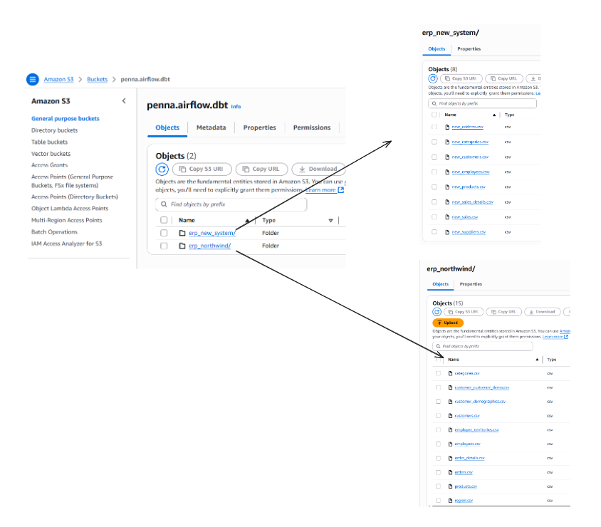
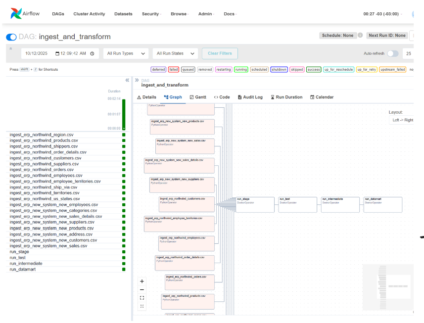
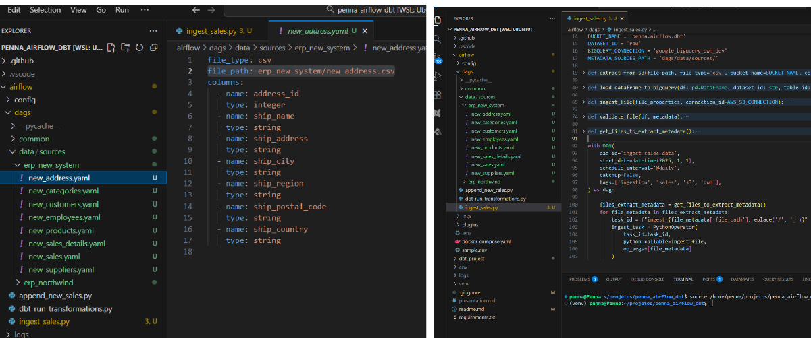
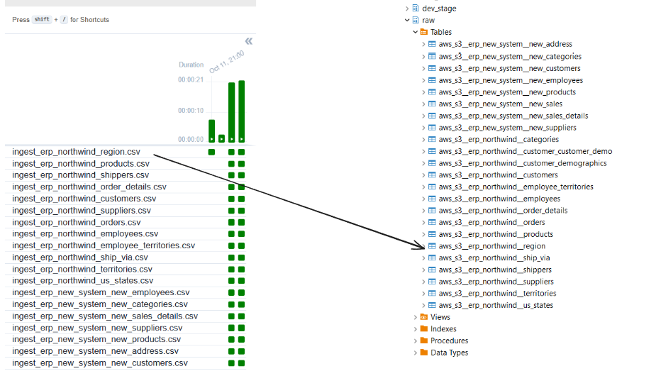

# Project Overview
This project implements a data transformation process using dbt (Data Build Tool) on Google BigQuery, with orchestration handled by Apache Airflow. The main goal is to merge information from two distinct systems with multiple tables to enable analysis from both sources at the same time.

## Data Sources
All our raw data come from csv located on s3 (you can reproduce that by coping all csv files on dbt_project/seeds and storing into a bucket on S3). Each folder is related to a different system:
  - erp_northwind: sales of northwind.
  - erp_new_system: fictional dataset created for this project.

## Data Flow
Our extractions are orchestrated by Airflow. The "ingest_and_transform" is our main DAG. It executes the file ingestion:
 - Get a list of files to be ingested
 - Extract data from csv files on S3
 - Validate data types and mandatory columns
 - Store into BigQuery

## Files to be extracted
The list of files that will be extracted come from the folder "airflow/dags/data/sources". 
Each system will have a specific folder and inside each folder there is a yaml file for each file on S3 that will be extracted from S3 to our data warehouse. Each file contains the metadata of the file. It is like a data contract with our expectations about the file.

## DAG script
This is the script behind the DAF that will execute the pipeline. It executes file ingestion (EL) and our transformations on DBT (T) and tests:

## CI/CD Process
To enable continous integrations and deployment of our new code minimizing errors, I am using GitHub Actions to execute only our new code, execute tests, and publishing it to production.
The ice of the cake here is that we will only execute new transformations, reducing the execution of unnecessary transformations.

When a new pull request is done on GitHub, starts CI:
 - All dependencies are installed
 - Get manifest.json from S3 (the same manifest.json from production (result of the final step of CD))
 - Compare manifest.json from production with the current version
 - Run only queries that was changed (all executions are done in a isolated dataset not affecting production neither development)

When a pull request is merged, two steps are executed:
CI teardown:
 - Delete the datasets related to pull_request
CD:
 - All dependencies are installed
 - Get manifest.json from S3 (the same manifest.json from production (result of the final step of CD))
 - Compare manifest.json from production with the current version
 - Run only queries that was changed (all executions are done in a isolated dataset not affecting production neither development)
 - Copy the new generated manifest.json to S3 (this will be used on our CI)

# Setup

## Requirements
  - Python 3.9
  - Docker and Docker Compose

## Setup bigquery
Go to BigQuery and create a project and dataset. Still on BigQuery generate a service account and download your project keys. Go to airflow folder and replace variables on the file 'Sample.env' with the respective values of the json you download from bigquery service account .json.
Rename the file Sample.env to '.env'. This file will be used by airflow and dbt to connect with bigquery and run airflow dags.

## Setup AWS S3
Go to S3 on AWS, create a bucket and create an IAM user with reading permission to this bucket.
Go to the '.env' and insert your credentials.

## Adjust airflow user on linux
Get your user id or create a user for airflow. This step is necessary because airflow will
update csv files on dbt_project/seeds and need the correct permissions to do it, so run command:

id -u

With the result, update the variable AIRFLOW_UID on airflow/.env file

## Set up dbt image
This creates an image that will generate a temporary container everytime we run a task on airflow related to dbt. Run commands:

cd dbt_project
docker build -t dbt_image .

*Run command 'docker images' to check if the image was created.

# Starting the project
## Start Airflow
Execute commands:

cd airflow
docker compose up airflow-dbt
cd ..

This will start each container of airflow.

## Access Airflow
You can access airflow on http://localhost:8080/ and login with the credentials you saved on _AIRFLOW_WWW_USER_USERNAME and _AIRFLOW_WWW_USER_PASSWORD.

## Create 2 connections on Aiflow
On airflow go to "Admin" > "Connections" and create these connections:
- S3:
Create a connection on airflow with "Connection Id" = 'aws_s3' "Connection Type" = 'Amazon Web Services' with your ACCESS_KEY_ID and SECRET_ACCESS_KEY

- BigQuery
Create a connection with "Connection Id" = 'google_bigquery_dwh_dev', "Connection Type" = 'Google Bigquery' and "Credential Configuration File" with the exact same text inside the json file you download from BigQuery.

# Execute
To execute the project, go to DAG "ingest_and_transform" and trigger the execution (play). Your pipeline will run extracting all files from S3, loading into bigquery and execute the transformations.

# Extra

## Do you want to execute dbt models out of airflow and docker?

## Create virtual enviroment
python -m venv venv
source venv/bin/activate

## Install dependecies
We only need on our enviroment dbt libraries (not necessary airflow). Run command:

pip install -r requirements.txt

# Setting up envirorment variables
This will set your environment variables (linux) temporally. Run command:

cd airflow
set -a; source .env; set +a
cd ..

# Execute dbt commands
With configurations above, you are all set to run dbt commands. Go dbt_project: 

cd dbt_project

## Roadmap

# Done
- Create extraction form S3 ✅
- Improve distinction between dev and prod datasets ✅
- Create an EC2, install and run the entire project ✅
- Remove dbt deps ✅
- Review transformation of fact_orders ✅
- Improve readme ✅
- Create CD to update code on production environment
- Create CD process ✅
- Create CI anc CI_Teardown ✅
- Create a dag to run the workflow (verify if i am saving data on other database from bigquery instead of previous database) ✅
- Delete folder utils from this folder and docker ✅
- Create a example file of the .env files ✅
- I got an error of permission on airflow accessing new_sales_details.csv. Maybe it is because I removed the "AIRFLOW_UID" ✅
- At the end of dag\append_new_sales, execute dbt -seed (I need to fix error on virtual enviroments) ✅
- Create airflow enviroment ✅
- Create a dag on airflow that insert a new sale and execute dbt project ✅
- Create schema.yml of datamart ✅
- Create datamart final tables ✅
- Create standard on names of intermediate models. Example: on dim_Customers, instead of Company_Name should be Customer_Name ✅
- Validate schema.yml of northwind stage ✅
- Create schema.yml of erp_new_system stage ✅
- Create schema.yml of intermediate ✅
- Improve int_fact_orders with data from erp_new_sales_system ✅
- Improve int_dim_products with data from erp_new_sales_system ✅
- Improve int_dim_shippers with data from erp_new_sales_system ✅
- Improve int_dim_customers with data from erp_new_sales_system ✅
- Improve int_dim_employees with data from erp_new_sales_system ✅
- Create stage/erp_new_system sources.yml ✅
- Create script northwind__ for each source ✅
- Adjust freight value on fact_orders (it is using the entire freight value for each order_detail) ✅
- Create sales table and CRUD ✅
- Create sales details table and CRUD ✅
- Create products table and CRUD ✅
- Create sellers table and CRUD ✅
- Create dim_customer ✅
- Create dim_shipper ✅