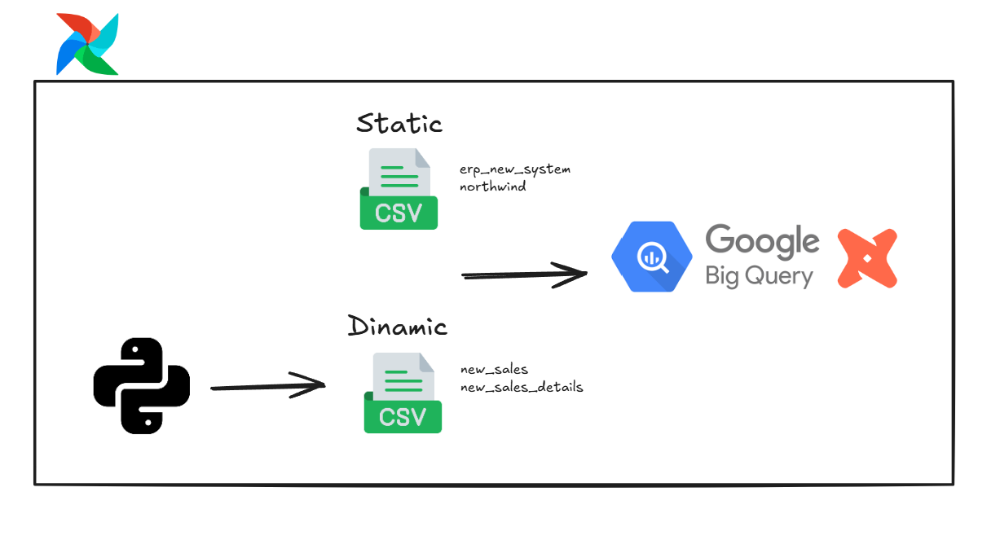

# Project Overview
This project implements a data transformation process using dbt (Data Build Tool) on Google BigQuery, with orchestration handled by Apache Airflow. The main goal is to merge information from two distinct systems with multiple tables to enable analysis from both sources at the same time.

## Data Sources
All our raw data come from csv located on dbt_project/seeds. Each source is on following folders:
  - erp_northwind: sales of northwind.
  - ero_new_system: fictional dataset created for this project.

## Data Flow
Most of our data are static files excepct by these two files below. It is possible to generate random data executing the dag append_new_sales. Each execution will add new rows to each csv and execute dbt_seeds command.
  - dbt_project/seeds/erp_new_system/new_sales.csv
  - dbt_project/seeds/erp_new_system/new_sales.details.csv

After executing dag append_new_sales, you can execute dag run_ransformations. This dag will update all of our bigquery pipeline areas (stage, intermediate and datamart).

## CI/CD Process
To keep enable continous integrations of our code and continuous deployment, I am using github actions to make incremental validation (only checking what was changed from previous deployment (manifest.json) comparing with the new deployment).

# Requirements
  - Python 3.9
  - Docker and Docker Compose

## Setup bigquery
Go to BigQuery and create a project and dataset. Still on BigQuery generate a service account and download your project keys. Go to airflow folder and replace variables on the file 'Sample.env' with the respective values of the json you download from bigquery service account .json.
Rename the file Sample.env to '.env'. This file will be used by airflow and dbt to connect with bigquery and run airflow dags.

## Adjust airflow user on linux
Get your user id or create a user for airflow. This step is necessary because airflow will
update csv files on dbt_project/seeds and need the correct permissions to do it, so run command:

id -u

With the result, update the variable AIRFLOW_UID on airflow/.env file

## Set up dbt image
This creates an image that will generate a temporary container everytime we run a task on airflow related to dbt. Run commands:

cd dbt_project
docker build -t dbt_image .

*Run command 'docker images' to check if the image was created.

## Set up airflow containers
This will create the containers that will run airflow. Run command:

cd airflow
docker compose up airflow-dbt
cd ..

# Starting the project
This will start running each container of airflow. Run commands:

cd airflow
docker compose up -d
cd ..

# Our DAGs
There are 2 DAGs:
  - "append_new_sales": this dag will add new random data to new_sales.csv and new_sales_details.csv on dbt_project/seeds/erp_new_system and execute dbt seeds to add all new data to our raw table.
  - "run_ransformations": this dag will create/update all project schemas (stage, intermediate, and datamart).

# Do you want to execute dbt models locally?

## Create virtual enviroment
python -m venv venv
source venv/bin/activate

## Install dependecies
We only need on our enviroment dbt libraries (not necessary airflow). Run command:

pip install -r requirements.txt

# Setting up envirorment variables
This will set your environment variables (linux) temporally. Run command:

cd airflow
set -a; source .env; set +a
cd ..

# Execute dbt commands
With configurations above, you are all set to run dbt commands. Go dbt_project: 

cd dbt_project

Now run dbt commands you want:

dbt seed

## Roadmap

# To do
- Create an EC2, install and run the entire project
- Create CI to update code on production environment
- Publish the project on github, linkedin, and telegram

# Done
- Remove dbt deps ✅
- Review transformation of fact_orders ✅
- Improve readme ✅
- Create CD process ✅
- Create CI anc CI_Teardown ✅
- Create a dag to run the workflow (verify if i am saving data on other database from bigquery instead of previous database) ✅
- Delete folder utils from this folder and docker ✅
- Create a example file of the .env files ✅
- I got an error of permission on airflow accessing new_sales_details.csv. Maybe it is because I removed the "AIRFLOW_UID" ✅
- At the end of dag\append_new_sales, execute dbt -seed (I need to fix error on virtual enviroments) ✅
- Create airflow enviroment ✅
- Create a dag on airflow that insert a new sale and execute dbt project ✅
- Create schema.yml of datamart ✅
- Create datamart final tables ✅
- Create standard on names of intermediate models. Example: on dim_Customers, instead of Company_Name should be Customer_Name ✅
- Validate schema.yml of northwind stage ✅
- Create schema.yml of erp_new_system stage ✅
- Create schema.yml of intermediate ✅
- Improve int_fact_orders with data from erp_new_sales_system ✅
- Improve int_dim_products with data from erp_new_sales_system ✅
- Improve int_dim_shippers with data from erp_new_sales_system ✅
- Improve int_dim_customers with data from erp_new_sales_system ✅
- Improve int_dim_employees with data from erp_new_sales_system ✅
- Create stage/erp_new_system sources.yml ✅
- Create script stg_ for each source ✅
- Adjust freight value on fact_orders (it is using the entire freight value for each order_detail) ✅
- Create sales table and CRUD ✅
- Create sales details table and CRUD ✅
- Create products table and CRUD ✅
- Create sellers table and CRUD ✅
- Create dim_customer ✅
- Create dim_shipper ✅